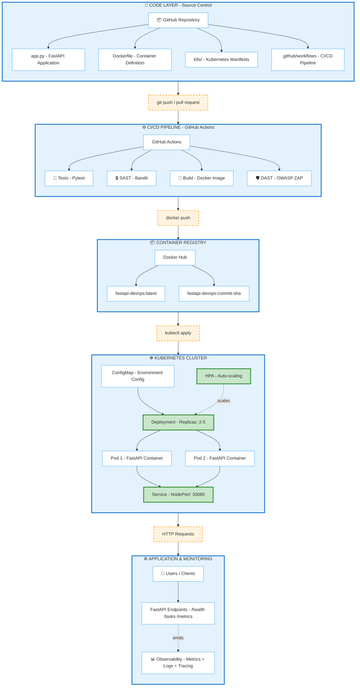

# FastAPI Task Management - DevOps Project

## Overview
A production-ready FastAPI application demonstrating DevOps best practices including CI/CD, containerization, Kubernetes deployment, observability, and security scanning.

## Features
- RESTful API for task management
- Prometheus metrics exposure
- Structured logging with trace IDs
- Docker containerization
- Kubernetes deployment with auto-scaling
- CI/CD pipeline with security scans
- Grafana dashboards for monitoring

## Prerequisites
- Docker Desktop with Kubernetes enabled
- Python 3.11+
- kubectl CLI
- Git

## Local Development

### Running with Python
```bash
# Install dependencies
pip install -r requirements.txt

# Run the application
uvicorn app:app --reload --port 8000

# Test the API
curl http://localhost:8000/health
```

### Running with Docker Compose
```bash
# Build and start
docker-compose up -d

# View logs
docker-compose logs -f

# Stop
docker-compose down
```

## Kubernetes Deployment

### Deploy to Local Cluster
```bash
# Apply all manifests
kubectl apply -f k8s/namespace.yaml
kubectl apply -f k8s/configmap.yaml
kubectl apply -f k8s/deployment.yaml
kubectl apply -f k8s/service.yaml
kubectl apply -f k8s/hpa.yaml

# Deploy monitoring
kubectl apply -f k8s/prometheus/
kubectl apply -f k8s/grafana/

# Verify deployment
kubectl get pods -n fastapi-app
```

### Access Services
- **API**: http://localhost:30080
- **Prometheus**: http://localhost:30090
- **Grafana**: http://localhost:30030 (admin/admin123)

## API Endpoints

### Create Task
```bash
curl -X POST http://localhost:30080/tasks \
  -H "Content-Type: application/json" \
  -d '{"title": "My Task", "description": "Task description"}'
```

### Get All Tasks
```bash
curl http://localhost:30080/tasks
```

### Get Specific Task
```bash
curl http://localhost:30080/tasks/1
```

### Delete Task
```bash
curl -X DELETE http://localhost:30080/tasks/1
```

### Health Check
```bash
curl http://localhost:30080/health
```

### Metrics
```bash
curl http://localhost:30080/metrics
```

## Observability

### Metrics
- Request count by endpoint, method, and status
- Request duration histograms
- Available at `/metrics` endpoint

### Logs
- Structured JSON logging
- Request tracing with unique trace IDs
- Log levels: INFO, WARNING, ERROR

### Dashboards
Access Grafana at http://localhost:30030 to view:
- Request rate trends
- Response time percentiles
- Error rates
- Request distribution by status code

## Security

### SAST (Static Analysis)
```bash
pip install bandit
bandit -r app.py
```

### DAST (Dynamic Analysis)
Automatically run in CI/CD pipeline using OWASP ZAP

## CI/CD Pipeline

### Stages
1. **Test**: Run pytest test suite
2. **SAST**: Bandit security scan
3. **Build**: Docker image build and push
4. **DAST**: OWASP ZAP security scan

### Triggering
```bash
git push origin main
```

View pipeline status: GitHub Actions tab

## Architecture
### Complete DevOps Pipeline



## Technologies Used
- **Backend**: FastAPI, Pydantic, Uvicorn
- **Containerization**: Docker, Docker Compose
- **Orchestration**: Kubernetes
- **Observability**: Prometheus, Grafana
- **CI/CD**: GitHub Actions
- **Security**: Bandit (SAST), OWASP ZAP (DAST)
- **Monitoring**: prometheus-client


## Project Structure
```
.
├── app.py                      # Main application
├── requirements.txt            # Python dependencies
├── Dockerfile                  # Container definition
├── docker-compose.yml          # Local development
├── .github/
│   └── workflows/
│       └── ci-cd.yaml         # CI/CD pipeline
├── k8s/
│   ├── namespace.yaml
│   ├── configmap.yaml
│   ├── deployment.yaml
│   ├── service.yaml
│   ├── hpa.yaml
│   ├── prometheus/
│   └── grafana/
└── tests/
    └── test_app.py            # Test suite
```

## Cleanup
```bash
# Delete Kubernetes resources
kubectl delete namespace fastapi-app

# Stop Docker Compose
docker-compose down -v
```

## Author
Ghada MHADHBI

